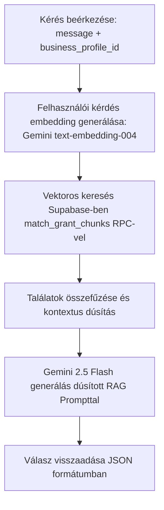

# Pályázati Adatbázis RAG Integrációs Terv (DIMOP / GINOP Plusz)

Ez a dokumentum a P-Search Mobil alkalmazás Pályázati Copilot funkciójához tervezett RAG (Retrieval-Augmented Generation) architektúra technikai specifikációját és megvalósítási lépéseit tartalmazza. A cél, hogy a felhasználók kérdéseire a modell a valós, jogilag hatályos pályázati kiírások szövegei alapján adjon pontos, naprakész és szakmai válaszokat.

---

## 1. Supabase Adatbázis Struktúra

A RAG architektúrában a pályázatok törzsadatait és a hozzájuk tartozó dokumentációk darabolt (chunked) szövegrészleteit külön táblákban tároljuk a hatékony kezelés és a vektoros indexelés érdekében.

### 1.1. Adatbázis Séma (DDL)

```sql
-- pgvector kiterjesztés engedélyezése
create extension if not exists vector;

-- 1. Pályázatok törzsadat táblája
create table if not exists public.grants (
    id uuid primary key default gen_random_uuid(),
    title text not null,                                   -- Pályázat címe (pl. GINOP Plusz-3.2.1)
    provider text,                                         -- Kiíró (pl. Nemzetgazdasági Minisztérium)
    grant_type text,                                       -- Pályázat típusa (vissza nem térítendő, hitel, hibrid)
    amount_min bigint default 0,                           -- Minimum elnyerhető összeg (Ft)
    amount_max bigint,                                     -- Maximum elnyerhető összeg (Ft)
    deadline timestamp with time zone,                     -- Beadási határidő
    eligibility_criteria text,                             -- Alapvető jogosultsági feltételek
    description text,                                      -- Rövid összefoglaló leírás
    source_url text,                                       -- Hivatalos forrás link (palyazat.gov.hu)
    created_at timestamp with time zone default timezone('utc'::text, now()) not null,
    updated_at timestamp with time zone default timezone('utc'::text, now()) not null
);

-- 2. Pályázati szövegrészletek (Chunks) táblája vektoros kereséshez
create table if not exists public.grant_chunks (
    id uuid primary key default gen_random_uuid(),
    grant_id uuid references public.grants(id) on delete cascade not null,
    content text not null,                                 -- A pályázati kiírás egy bekezdése / logikai egysége
    embedding vector(768) not null,                        -- 768 dimenziós embedding (Gemini text-embedding-004-hez méretezve)
    metadata jsonb default '{}'::jsonb not null,           -- Opcionális metaadatok: pl. oldalszám, szakasz címe, verzió
    created_at timestamp with time zone default timezone('utc'::text, now()) not null
);

-- Automatikus updated_at trigger a grants táblához
create or replace function update_updated_at_column()
returns trigger as $$
begin
    new.updated_at = now();
    return new;
end;
$$ language plpgsql;

create trigger set_grants_updated_at
    before update on public.grants
    for each row
    execute function update_updated_at_column();
```

### 1.2. Row-Level Security (RLS) beállítások

Annak érdekében, hogy a pályázati adatok biztonságosan hozzáférhetőek legyenek az ügyfelek számára, de a módosítások védettek maradjanak:

```sql
-- RLS engedélyezése
alter table public.grants enable row level security;
alter table public.grant_chunks enable row level security;

-- Olvasási szabályok (Minden bejelentkezett felhasználó olvashatja a pályázatokat)
create policy "Allow read access for authenticated users on grants"
    on public.grants for select
    to authenticated
    using (true);

create policy "Allow read access for authenticated users on grant_chunks"
    on public.grant_chunks for select
    to authenticated
    using (true);

-- Írási/Módosítási szabályok (Kizárólag a service_role - pl. adminisztrációs scraper scriptek - írhatja)
create policy "Allow all access for service_role on grants"
    on public.grants for all
    to service_role
    using (true)
    with check (true);

create policy "Allow all access for service_role on grant_chunks"
    on public.grant_chunks for all
    to service_role
    using (true)
    with check (true);
```

---

## 2. Vektoros Keresés (pgvector)

A szemantikai keresés gyorsasága érdekében a vektoros hasonlóságot kereső logikát közvetlenül az adatbázison belül (PostgreSQL-ben) HNSW (Hierarchical Navigable Small World) indexeléssel és egy Database Function (RPC) segítségével valósítjuk meg.

### 2.1. HNSW Index létrehozása

Az HNSW index lényegesen jobb teljesítményt nyújt a lekérdezéseknél a hagyományos IVFFlat indexhez képest, és nem igényel előzetes tréninget/építést a kezdeti adathalmazon. Mivel koszinusz hasonlóságot fogunk használni, a `vector_cosine_ops` operátorosztályt alkalmazzuk.

```sql
create index on public.grant_chunks using hnsw (embedding vector_cosine_ops);
```

### 2.2. Hasonlósági Kereső Függvény (RPC)

A backend Edge Functionből ezt a tárolt eljárást hívjuk meg a felhasználó üzenetének embeddingjével.

```sql
create or replace function public.match_grant_chunks(
    query_embedding vector(768),
    match_threshold float,
    match_count int
)
returns table (
    chunk_id uuid,
    grant_id uuid,
    grant_title text,
    content text,
    similarity float
)
language plpgsql stable
as $$
begin
    return query
    select
        gc.id as chunk_id,
        gc.grant_id,
        g.title as grant_title,
        gc.content,
        1 - (gc.embedding <=> query_embedding) as similarity
    from public.grant_chunks gc
    join public.grants g on gc.grant_id = g.id
    where 1 - (gc.embedding <=> query_embedding) > match_threshold
    order by gc.embedding <=> query_embedding asc
    limit match_count;
end;
$$;
```

---

## 3. Edge Function Logika Frissítése (`chat-with-gemini`)

A RAG integráció során a `supabase/functions/chat-with-gemini/index.ts` fájlban az alábbi pipeline szerint módosítjuk a működést:



### 3.1. Részletes kódterv az Edge Functionhöz

A meglévő Edge functionbe a következő logikai lépések épülnek be:

#### A) Felhasználó kérdésének vektorizálása (Embedding)
A Gemini API hivatalos SDK-jának használatával először lefordítjuk a felhasználó kérdését egy 768 dimenziós vektorra:

```typescript
// Gemini Embedding modell példányosítása
const embeddingModel = genAI.getGenerativeModel({ model: "text-embedding-004" });

// Vektor generálása
const embedResult = await embeddingModel.embedContent({
  content: { parts: [{ text: message }] }
});
const queryEmbedding = embedResult.embedding.values;
```

#### B) Supabase Vektoros lekérdezés futtatása
Az RPC függvény meghívásával lekérjük a leginkább releváns pályázati szövegrészleteket:

```typescript
console.log("Releváns pályázati részletek keresése vektoros adatbázisban...");
const { data: matchedChunks, error: rpcError } = await supabaseClient
  .rpc('match_grant_chunks', {
    query_embedding: queryEmbedding,
    match_threshold: 0.6, // Küszöbérték a releváns találatok kiszűrésére
    match_count: 4        // Legjobb 4 találat beemelése
  });

if (rpcError) {
  console.error("Hiba történt a vektoros keresés során:", rpcError);
}
```

#### C) Rendszerprompt dúsítása (Context Enrichment)
A talált kontextust beépítjük a modellnek átadott rendszerutasításba:

```typescript
let ragContext = "";
if (matchedChunks && matchedChunks.length > 0) {
  ragContext = "\n--- RELEVÁNS PÁLYÁZATI CIKKEK ÉS RÉSZLETEK ---\n";
  matchedChunks.forEach((chunk: any) => {
    ragContext += `\nPályázat: ${chunk.grant_title}\nSzövegrészlet:\n${chunk.content}\n[Hasonlóság: ${(chunk.similarity * 100).toFixed(1)}%]\n`;
  });
}

// A rendszerszintű prompt dúsítása
const systemPrompt = `Te egy Professzionális Pályázati és Digitalizációs Szakértő Copilot vagy, a P-Search AI asszisztense...

${companyContext ? `Aktuális ügyfél (cég) adatai:\n${companyContext}\n` : ""}
${grantContext ? `Aktuálisan tárgyalt pályázat adatai:\n${grantContext}\n` : ""}
${ragContext ? `Megbízható Pályázati források a tudásbázisból (RAG):\n${ragContext}\n` : ""}
...
`;
```

---

## 4. Megvalósítási Mérföldkövek és Tesztelés

1. **Adatbázis Migráció:** Futtatni kell a DDL-t és az RPC deklarációt a Supabase SQL Editorban vagy a Supabase CLI segítségével.
2. **Scraper & Chunking Pipeline:** Létre kell hozni egy Node.js/Python scriptet (pl. n8n workflow-val kiegészítve), amely letölti a GINOP/DIMOP PDF-eket, bekezdésekre bontja őket (~1000-1500 karakteres darabok 20% átfedéssel), legenerálja rájuk az embeddinget és feltölti őket a `public.grant_chunks` táblába.
3. **Belső Edge Function Tesztelés:** `supabase functions serve` segítségével lokálisan tesztelni a megújult `chat-with-gemini` végpontot.
4. **Kiértékelés (RAG Evaluation):** Ellenőrizni, hogy a modell pontosan hivatkozik-e a RAG-ből kapott összegekre, határidőkre és feltételekre, valamint kizárja-e a "hallucinációkat".
